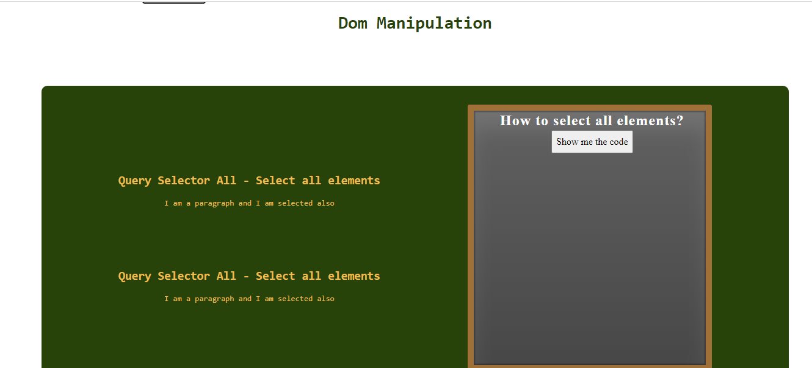
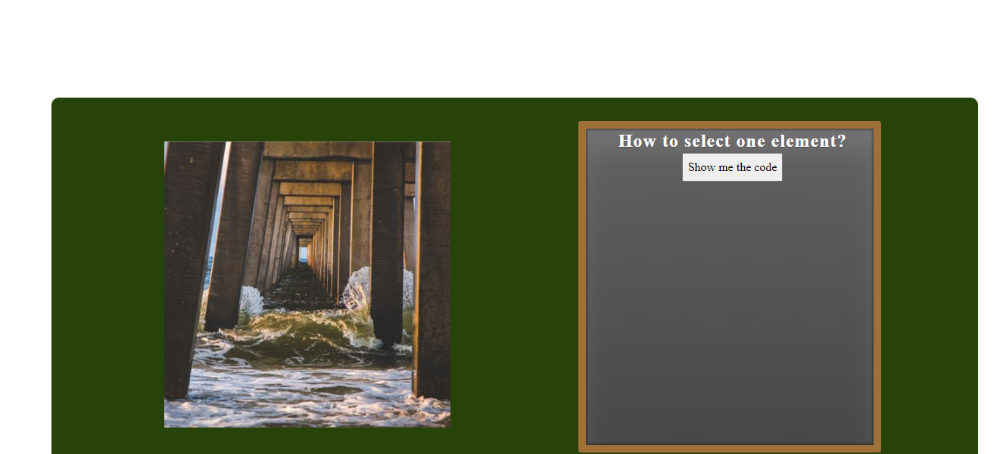

<h1 align="center"> 🔥Dom Manipulation🔥</h1>

<h2 align="center"> Learn more about template strings, text content, innerHTML and more</h2>

### Index

- [Name](#Name) 👈
- [Links](#Links) 🔗
- [Description](#Description) 📖
- [Languages and Frameworks](####Languages-and-Frameworks) ⚙️
- [Screenshots](#Screenshots) 📱
- [Instalation](#Instalation) 🧩
- [Support](#Support) 🆘
- [Roadmap](#Roadmap) 🗺️
- [Authors and acknowledgment](####Authors-and-acknowledgment) ✍️
- [Project Status](#Project-Status) 📜

# Name

My Blog Posts

# Links

[Website](https://gscreationsdom.netlify.app/)
[Tutorial](https://www.gscreations.io/coding/dom-manipulation)
[CodePen](https://codepen.io/mugas/pen/QWGJrRa)

---

# Description

Learn with 3 examples about string templates, query selectors, innerHTML, and the most important way to use the DOM in your favor
---

---

# Languages, Frameworks and others

- **Javascript** - Language
- **Font awesome** - Icons

---

# Screenshots

|          Home Page           |           Blog Page           |
| :--------------------------: | :---------------------------: |
|  |  |

---

# Instalation

---

# Support

Have any question or find something that doesn't look good? Let's talk 😊

[Here](https://github.com/mugas)

[And Here](https://www.gscreations.io/contact)

[Also Here](https://twitter.com/mugas11)

---

# Roadmap

Nothing for now

---

# Authors-and-acknowledgment

- The idea came after the course of [Wes Bos] (<https://courses.wesbos.com/>)

---

# Project-Status

Next post is coming

---
