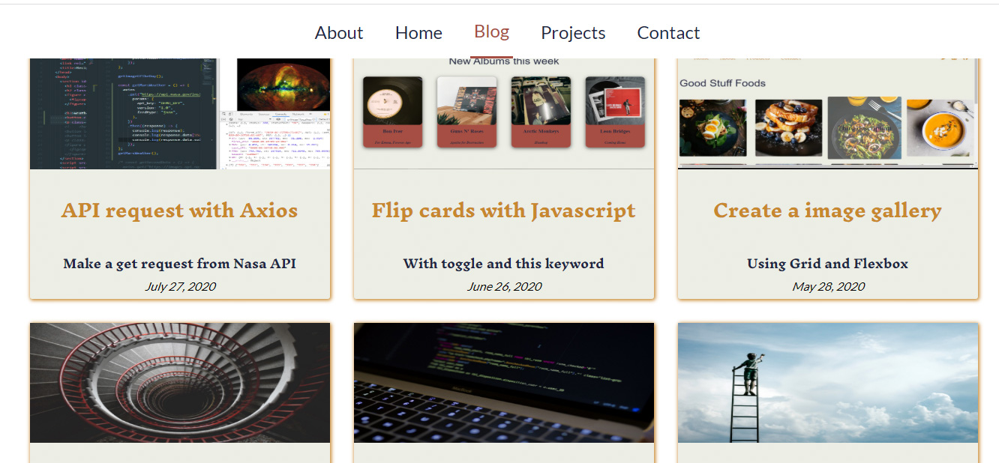

<h1 align="center"> 🔥Api requests🔥</h1>

<h2 align="center"> Make a get request with Axios</h2>

### Index

* [Name](#Name) 👈
* [Links](#Links) 🔗
* [Description](#Description) 📖
* [Languages and Frameworks](####Languages-and-Frameworks) ⚙️
* [Screenshots](#Screenshots) 📱
* [Instalation](#Instalation) 🧩
* [Support](#Support) 🆘
* [Roadmap](#Roadmap) 🗺️
* [Authors and acknowledgment](####Authors-and-acknowledgment) ✍️
* [Project Status](#Project-Status) 📜

# Name

Api Rquests

# Links

[Project page](https://nasaapiaxios.netlify.app/)

[Tutorial page](https://www.ricardomoreira.io/blog/2020-07-22-api-request-with-axios)

[Code Pen](https://codepen.io/collection/AdQGRM)

You also can read it [here](https://dev.to/mugas/make-a-api-request-using-axios-and-nasa-api-5h11) and [here](https://medium.com/@ricardo.d.moreira.rm/make-a-api-request-using-axios-and-nasa-api-8af4925acc4f)

___

# Description

What is an API and axios and how to make a get request using the Nasa API. Create a small website with many info from different Nasa Apis.

___

# Languages, Frameworks and others

* **Javascript** - Language
* **Parcel** - Bundler

____

# Screenshots

Home Page         |  Blog Page
:-------------------------:|:-------------------------:
  |  

____

# Instalation

___

# Support

Have any question or find something that doesn't look good? Let's talk 😊

[Here](https://github.com/mugas)

[And Here](https://www.ricardomoreira.io/about)

____

# Roadmap

Blog post done

____

# Authors-and-acknowledgment

* Me 😊

____

# Project-Status  

Done.

____
