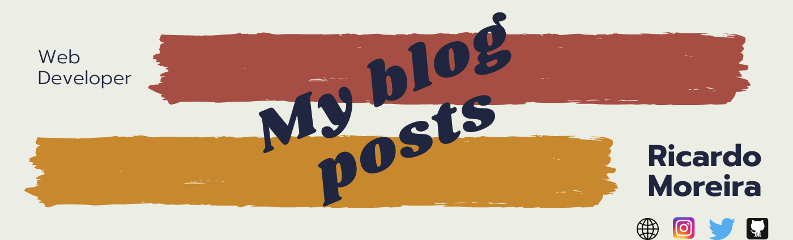
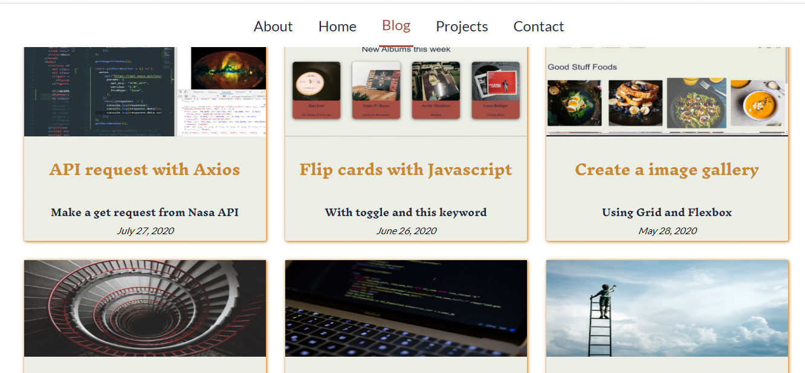
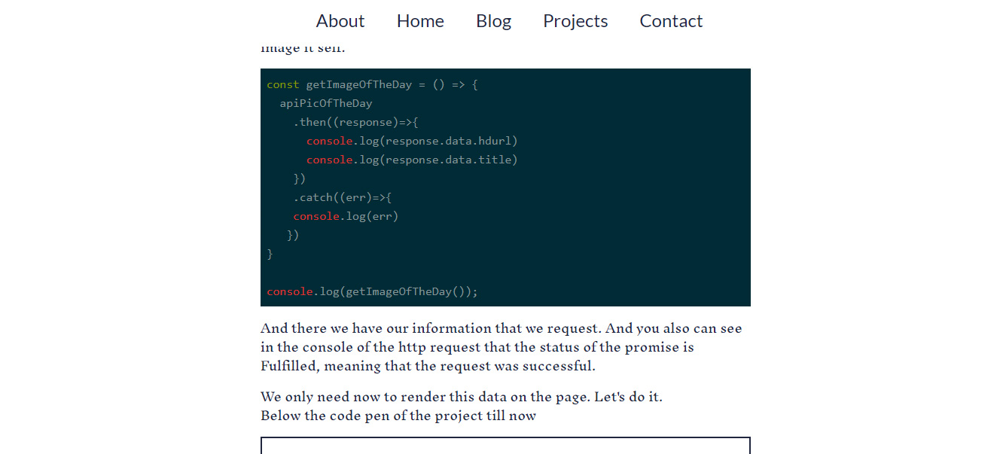

<h1 align="center"> 🔥My blog Posts🔥</h1>

<h2 align="center"> All the info about my blog posts in one repository</h2>

### Index

* [Name](#Name) 👈
* [Links](#Links) 🔗
* [Description](#Description) 📖
* [Languages and Frameworks](####Languages-and-Frameworks) ⚙️
* [Screenshots](#Screenshots) 📱
* [Instalation](#Instalation) 🧩
* [Support](#Support) 🆘
* [Roadmap](#Roadmap) 🗺️
* [Authors and acknowledgment](####Authors-and-acknowledgment) ✍️
* [Project Status](#Project-Status) 📜

# Name

My Blog Posts

# Links

[Website](https://www.ricardomoreira.io/blog)

___

# Description

I decided to start writing technical blog posts about javascrit and Nuxt or whatever I am learning. Here you can find all the code for them

___

# List of blog posts

* [Control Flow on Javascript](https://www.ricardomoreira.io/blog/2020-05-27-control-flow-on-javascript/)
* [Loops with examples](https://www.ricardomoreira.io/blog/2020-05-27-loops-with-examples/)
* [Flip cards with Javascript](https://www.ricardomoreira.io/blog/2020-06-15-flip-cards-with-javascript/)
* [Create a image gallery](https://www.ricardomoreira.io/blog/2020-05-28-create-a-image-gallery/)
* [API request with Axios](https://www.ricardomoreira.io/blog/2020-07-22-api-request-with-axios)

___

# Languages, Frameworks and others

* **Javascript** - Language
* **Font awesome** - Icons
* **Axios** - Javascript library

____

# Screenshots

Home Page         |  Blog Page
:-------------------------:|:-------------------------:
  |  

____

# Instalation

___

# Support

Have any question or find something that doesn't look good? Let's talk 😊

[Here](https://github.com/mugas)

[And Here](https://www.ricardomoreira.io/about)

____

# Roadmap

It will be a never ending project. Every time I write something with code and put it on a blog is going to be added here.

____

# Authors-and-acknowledgment

* I choose a topic and then I search about it and write the post. So even that I got inpired by others, the final product is an original😃

____

# Project-Status  

Next post is coming

____
